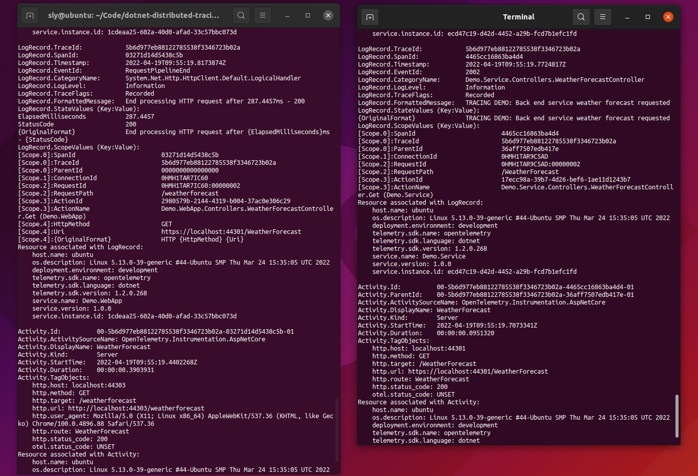

# Dotnet Distributed Tracing Examples

Example of distributed tracing in .NET, using W3C Trace Context, Azure Application Insights, (TODO: and OpenTelemetry).

See each example for detailed instructions.

### Requirements

* Dotnet 5.0
* Docker (with docker-compose), for local services
* Azure subscription, for cloud services
* Azure CLI, to create cloud resources
* Powershell, for running scripts

## [1) Basic example](src/1-basic/ReadMe.md)

The web front end needs to be handled a little different, so the first basic example involves server to server calls between the Web API and a back end Web Service. Distributed trace correlation is already built into the recent versions of dotnet.

**NOTE:** If you have trouble with HTTPS, or do not have certificats set up, then see the section at
the end of this file for HTTPS Developer Certificates.

## [2) Local logger - Elasticsearch](src/2-elasticsearch/ReadMe.md)

Distributed trace correlation is also supported out of the box by many logging providers.

For example, you can run a local Elasticsearch service to send logs to from multiple services, so they can be viewed together.

### Run local Elasticsearch and Kibana

You need to be running Elasticsearch and Kibana, for example on Linux a docker compose 
configuration is provided. There are a number of prerequesites that you will need to meet, 
such as enough file handles; the elk-docker project provides a good list, including 
some troubleshooting (see https://elk-docker.readthedocs.io/).

## [3) Azure message bus](src/3-messagebus/ReadMe.md)

Example manually configuring Azure service bus message handler to read the incoming correlation identifier (which is automatically sent) and start a local child.

### No automatic tracing with base Azure message bus

Although the Azure message bus documentation talks about "Service Bus calls done by your service are automatically tracked and correlated", and does provide tracing instrumentation points, the tracing is only automatic if you are using a tracing provider, such as Application Insights or OpenTelemetry.

If you do not have a tracing provider, then traces are not directly correlated (and activities aren't even used if there is no `DiagnosticsListener` attached)

For manual correlation, the `Diagnostic-Id` is automatically set when sending messages with the `traceparent` details of the source activity, so it is relatively easy to manually start a new child `Activity` in the receiving code set with the provided parent.


## [4) Using Azure Monitor / Application Insights](src/4-azuremonitor/ReadMe.md)

Example leveraging Azure Application Insights and how the built-in distribute trace correlation works with it, including the application map.

### View Azure Monitor results

As well as the log messages themselves, Application Insights also gives you timing information for each trace, for investigating performance, and an application map.

#### Performance

The Performance tools in Application Insights can be used to show the End-to-end transaction with the correlation Operation ID (the same as the console), along with a hierarchical timeline of events.

There will be a top level event for **localhost:44302** with two children for the **Message** and **localhost:44301** (the back end service).

The "View all telemetry" button will show all the messages, including traces.


#### Application Map

The Application Map builds a picture of how your services collaborate, showing how components are related by messages.

For this simple application, the Hierarchical View clearly shows how the WebApp calls the Service, and also sends a message to the Worker.


## [A) Using OpenTelemetry](src/a-opentelemetry/ReadMe.md)

A basic example using OpenTelemetry, showing correlation between two tiers, exporting both logging and activity tracing to the console, along with service details.




## TODO list

* SQL Server auto-instrumentation
* Application Insights front end instrumentation (and issues/workarounds)
* All the OpenTelemetry stuff


## HTTPS Developer Certificates

### Windows and macOS

See: https://docs.microsoft.com/en-us/aspnet/core/security/enforcing-ssl?view=aspnetcore-5.0&tabs=visual-studio#trust-the-aspnet-core-https-development-certificate-on-windows-and-macos

The certificate is automatically installed. To trust the certificate:

```
dotnet dev-certs https --trust
```

### Ubuntu

See: https://docs.microsoft.com/en-us/aspnet/core/security/enforcing-ssl?view=aspnetcore-5.0&tabs=visual-studio#ubuntu-trust-the-certificate-for-service-to-service-communication

Create the HTTPS developer certificate for the current user personal certificate store (if not already initialised). 

```
dotnet dev-certs https
```

You can check the certificate exists for the current user; the file name is the SHA1 thumbprint. (If you want to clear out previous certificates use `dotnet dev-certs https --clean`, which will delete the file.)

```
ls ~/.dotnet/corefx/cryptography/x509stores/my
```

#### Trust the certificate for server communication

You need to have OpenSSL installed (check with `openssl version`).

Install the certificate. You need to use the `-E` flag with `sudo` when exporting the file, so that it exports the file for the current user (otherwise it will export the file for root, which will be different).

```
sudo -E dotnet dev-certs https -ep /usr/local/share/ca-certificates/aspnet/https.crt --format PEM
sudo update-ca-certificates
```

You can check the file exists, and then use open SSL to verify it has the same SHA1 thumbprint.

```
ls /usr/local/share/ca-certificates/aspnet
openssl x509 -noout -fingerprint -sha1 -inform pem -in /usr/local/share/ca-certificates/aspnet/https.crt
```

If the thumbprints do not match, you may have install the root (sudo user) certificate. You can check it at `sudo ls -la /root/.dotnet/corefx/cryptography/x509stores/my`.

#### Trust in Chrome

```
sudo apt-get install -y libnss3-tools
certutil -d sql:$HOME/.pki/nssdb -A -t "P,," -n localhost -i /usr/local/share/ca-certificates/aspnet/https.crt
certutil -d sql:$HOME/.pki/nssdb -A -t "C,," -n localhost -i /usr/local/share/ca-certificates/aspnet/https.crt
```

#### Trust in Firefox:

```
cat <<EOF | sudo tee /usr/lib/firefox/distribution/policies.json
{
    "policies": {
        "Certificates": {
            "Install": [
                "/usr/local/share/ca-certificates/aspnet/https.crt"
            ]
        }
    }
}
EOF
```
