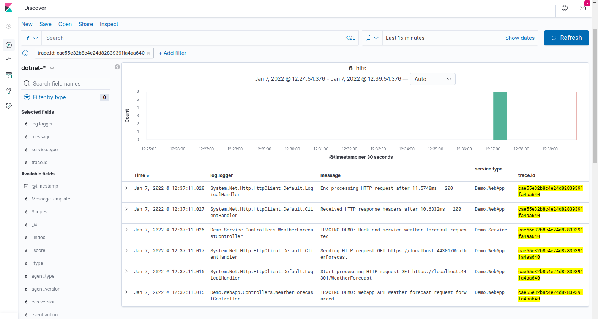

# Dotnet Distributed Tracing Examples

Example of distributed tracing in .NET, using W3C Trace Context and OpenTelemetry.

## 2) Local logger - Elasticsearch

Distributed trace correlation is also supported out of the box by many logging providers.

For example, you can run a local Elasticsearch service to send logs to from multiple services, so they can be viewed together.

### Requirements

* Dotnet 5.0
* Docker (with docker-compose), for local services

### Run local Elasticsearch and Kibana

You need to be running Elasticsearch and Kibana, for example on Linux a docker compose 
configuration is provided. There are a number of prerequesites that you will need to meet, 
such as enough file handles; the elk-docker project provides a good list, including 
some troubleshooting (see https://elk-docker.readthedocs.io/).

For example, the most common issue is mmap count limit, which can be changed via: 

```sh
echo vm.max_map_count=262144 | sudo tee -a /etc/sysctl.conf
sudo sysctl -p
```

Once the prerequisites are satisfied, you can bring up the docker-compose file, which will create two nodes, one for Elasticsearch and one for Kibana:

```sh
docker-compose -p demo up -d
```

To check the Kibana console, browse to `http://localhost:5601`

### Add Elasticsearch logger to app

A logger provider is available that can write directly to Elasticsearch. It can be installed via nuget.

```sh
dotnet add Demo.WebApp package Elasticsearch.Extensions.Logging --version 1.6.0-alpha1
```

To use the logger provider you need add a using statement at the top of `Program.cs`:

```csharp
using Elasticsearch.Extensions.Logging;
```

Then add a `ConfigureLogging` section to the host builder:

```csharp
  Host.CreateDefaultBuilder(args)
    .ConfigureLogging((hostContext, loggingBuilder) =>
    {
        loggingBuilder.AddElasticsearch();
    })
    ...
```

Repeat this for the back end service, adding the package, and the configuration as above:

```sh
dotnet add Demo.Service package Elasticsearch.Extensions.Logging --version 1.6.0-alpha1
```

### Run the two services with Elasticsearch

In separate terminals run the service:

```sh
dotnet run --project Demo.Service --urls "https://*:44301" --environment Development
```

And web app + api:

```sh
dotnet run --project Demo.WebApp --urls "https://*:44302" --environment Development
```

And check the front end at `https://localhost:44302/fetch-data`


### Initialise Kibana and view logs

Once you have run the application and sent some log event, you need to open Kibana (http://localhost:5601/) and initialise the database.

Navigate to **Management** > **Index Patterns** and click **Create index pattern**. Enter "dotnet-*" as the pattern (it should match the entries just created) and click **Next step**. Select the time filter "@timestamp", and click **Create index pattern**.

Once the index is created you can use **Explore** to view the log entries.

If you add the columns `service.type`, `trace.id`, and `message`, then you can see the messages from the web app and back end service are correlated by the trace ID.


