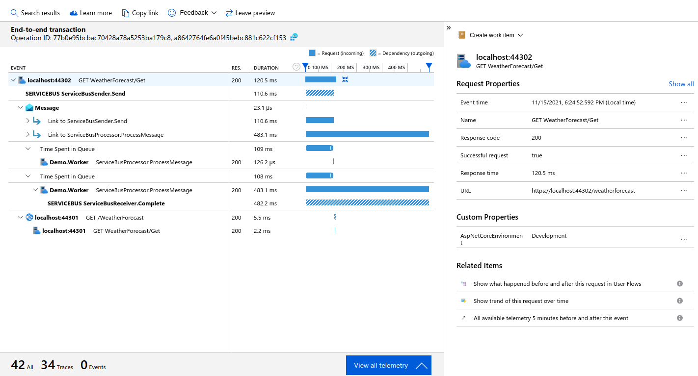
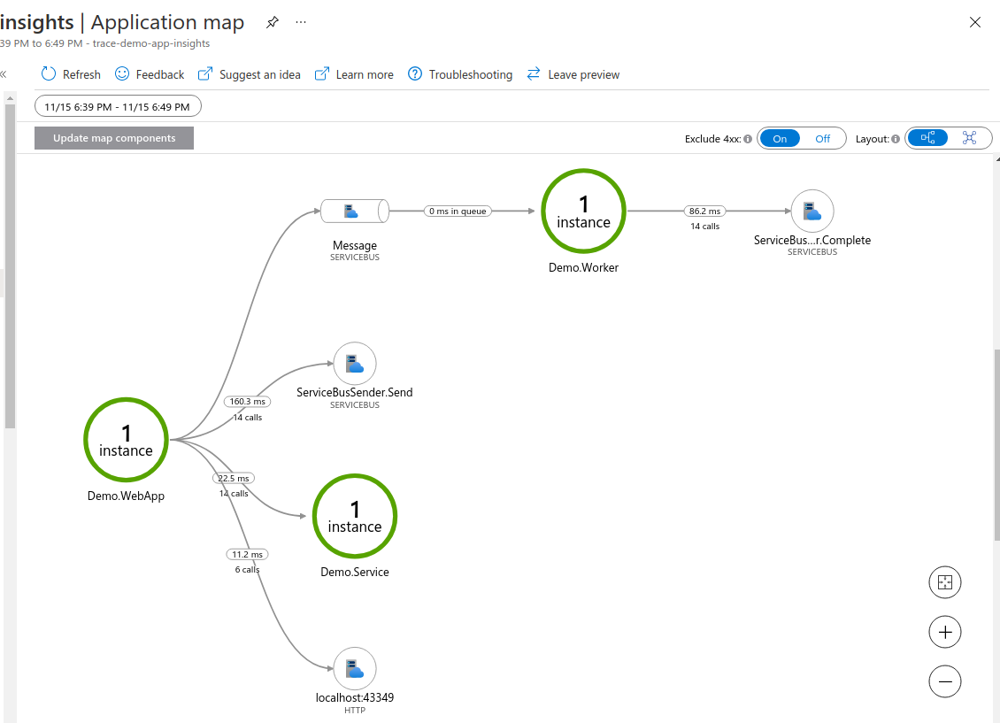

# Dotnet Distributed Tracing Examples

Example of distributed tracing in .NET, using W3C Trace Context and OpenTelemetry.

## 4) Using Azure Monitor / Application Insights

Example leveraging Azure Application Insights and how the built-in distribute trace correlation works with it, including the application map.

### Requirements

* Dotnet 5.0
* Azure subscription, for cloud services
* Azure CLI, to create cloud resources
* Powershell, for running scripts


### Set up Azure Monitor workbench and Application Insights

Log in to your Azure resources if necessary

```powershell
az login
```

Then use the script to create the required resources, which will also output the required connection string.

```powershell
$VerbosePreference = 'Continue'
./deploy-infrastructure.ps1
```

This will create an Azure Monitor Log Analytics Workspace, and then an Application Insights instance connected to it.

You can log in to the Azure portal to check the logging components were created at `https://portal.azure.com`

### Add configuration

The script will output the connection string that you need to use. Add the connection string to an ApplicationInsights section in `appsettings.Development.json` for all three projects (WebApp, Service, Worker). Alternatively, you can specify it via the command line or environment variables when running (see below).

```json
  "ApplicationInsights": {
    "ConnectionString" : "InstrumentationKey=b18fd39c-cb28-41ea-a2a2-d0763f1085b4;IngestionEndpoint=https://australiaeast-1.in.applicationinsights.azure.com/"
  },
```

Also, by default only Warning logs and above are collected. In the same three `appsettings.Development.json` files change the configuration to add configuration for the ApplicationInsights logger to include Information level and above:

```json
  "Logging": {
    "ApplicationInsights": {
      "LogLevel": {
        "Default": "Information"
      }
    },
```

### Add libraries

Add packages for ApplicationInsights to all three projects. There are packages for AspNetCore and a separate package for WorkerService.

```sh
dotnet add Demo.WebApp package Microsoft.ApplicationInsights.AspNetCore
dotnet add Demo.Service package Microsoft.ApplicationInsights.AspNetCore
dotnet add Demo.Worker package Microsoft.ApplicationInsights.WorkerService
```

### Enable application insights

Add application insights services in `Startup.cs` of the WebApp project. (This will also enable logging.)

```csharp
        public void ConfigureServices(IServiceCollection services)
        {
            services.AddApplicationInsightsTelemetry();
```

And also in `Startup.cs` of the Service project:

```csharp
        public void ConfigureServices(IServiceCollection services)
        {
            services.AddApplicationInsightsTelemetry();
```

The service configuration for the Worker project is directly in `Program.cs`. You need to add the worker service telemetry here (which is different than the ASP.NET library).

```csharp
                .ConfigureServices((hostContext, services) =>
                {
                    services.AddApplicationInsightsTelemetryWorkerService();
```

Also comment out the usage of Elasticsearch, so that it doesn't appear in the Application Map (it uses port 9200 for logging).

```csharp
  // loggingBuilder.AddElasticsearch();
```

### Service bus integration with App Insights

Instead of a generic activity, use the App Insights TelemetryClient to start the message received operation in `Worker.cs`.

Because we are using an extension method (StartOperation), we need to reference the ApplicationInsights. We then need to create a class field and inject the TelemetryClient in the constructor.

Then create the activity and set the parent, if available, as before, and then use StartOperation(), passing in the activity (instead of manually starting the Activity).

```csharp
using Microsoft.ApplicationInsights;
...
        private readonly TelemetryClient _telemetryClient;
...
        public Worker(ILogger<Worker> logger, TelemetryClient telemetryClient, Azure.Messaging.ServiceBus.ServiceBusClient serviceBusClient)
        {
          _telemetryClient = telemetryClient;
...
        protected override async Task ExecuteAsync(CancellationToken stoppingToken)
        {
            await using var serviceBusProcessor = _serviceBusClient.CreateProcessor("demo-queue");
            serviceBusProcessor.ProcessMessageAsync += args =>
            {
                using var activity = new System.Diagnostics.Activity("ServiceBusProcessor.ProcessMessage");
                if (args.Message.ApplicationProperties.TryGetValue("Diagnostic-Id", out var objectId) &&
                    objectId is string traceparent)
                {
                    activity.SetParentId(traceparent);
                }
                using var operation = _telemetryClient.StartOperation<RequestTelemetry>(activity);
...
```

### Configure properties via a TelemetryInitializer

The role instance defaults to just the machine name, the the version defaults to the high level application version. 

It can be useful to set a specific name per component, and to include the full informational version (e.g. semantic version). You can register a TelemetryInitializer to customise these properties.

```sh
dotnet new classlib --output Demo.ApplicationInsights
dotnet sln add Demo.ApplicationInsights
dotnet add Demo.ApplicationInsights package Microsoft.ApplicationInsights
dotnet add Demo.WebApp reference Demo.ApplicationInsights
dotnet add Demo.Service reference Demo.ApplicationInsights
dotnet add Demo.Worker reference Demo.ApplicationInsights
```

Remove the default `Class1.cs`, and create a file `DemoTelemetryInitializer.cs` with the following:

```csharp
using System.Linq;
using System.Reflection;
using Microsoft.ApplicationInsights.Channel;
using Microsoft.ApplicationInsights.Extensibility;

namespace Demo.ApplicationInsights
{
    public class DemoTelemetryInitializer : ITelemetryInitializer
    {
        private readonly string? _entryAssemblyName;
        private readonly string? _version;

        public DemoTelemetryInitializer()
        {
            var entryAssembly = Assembly.GetEntryAssembly();
            var entryAssemblyName = entryAssembly?.GetName();
            _entryAssemblyName = entryAssemblyName?.Name;
            var versionAttribute = entryAssembly?.GetCustomAttributes(false)
                .OfType<AssemblyInformationalVersionAttribute>()
                .FirstOrDefault();
            _version = versionAttribute?.InformationalVersion ?? entryAssemblyName?.Version?.ToString();
        }

        public void Initialize(ITelemetry telemetry)
        {
            telemetry.Context.Component.Version = _version;
            telemetry.Context.Cloud.RoleName = _entryAssemblyName;
        }
    }
}
```

Register this in the startup, or equivalent, of the three projects:

```csharp
services.AddSingleton<ITelemetryInitializer, DemoTelemetryInitializer>();
```


### Run all three applications

If you have configured `appsettings.Development.json` for all projects they can be started directly. (You can also pass in from the console, as previously shown).

Console worker:

```powershell
./set-environment.ps1
dotnet run --project Demo.Worker
```

Back end service:

```powershell
./set-environment.ps1
dotnet run --project Demo.Service --urls "https://*:44301"
```

And web app + api:

```powershell
./set-environment.ps1
dotnet run --project Demo.WebApp --urls "https://*:44302"
```

Generate some activity from the front end at `https://localhost:44302/fetch-data`, and then
check the results in Azure Monitor.

### View Azure Monitor results

Log in to Azure Portal, https://portal.azure.com/

#### Logs

Open the Log Analytics workspace that was created. The default will be under
Home > Resource groups > rg-tracedemo-dev-001 > log-tracedemo-dev

Select General > Logs from the left. Dismiss the Queries popup to get to an empty editor.

Note that you may have to wait a bit for logs to be injested and appear in the workspace.

To see the events corresponding to the buttons in the sample app, you can use the following query:

```
union AppDependencies, AppExceptions, AppRequests, AppTraces
| where TimeGenerated  > ago(1h)
| where Properties.CategoryName startswith "Demo." 
| sort by TimeGenerated desc
| project TimeGenerated, OperationId, SeverityLevel, Message, Name, Type, DependencyType, Properties.CategoryName, OperationName, ParentId, SessionId, AppRoleName, AppVersion, AppRoleInstance, UserId, ClientType, Id, Properties
```

You will see the related logs have the same OperationId.

#### Performance

Open the Application Insights that was created. The default will be under
Home > Resource groups > rg-tracedemo-dev-001 > appi-tracedemo-dev

Select Performance on the left hand menu, then Operation Name "GET WeatherForecast/Get" (the top level operation requesting the page). The right hand side will show the instances.

Click on "Drill into... N Samples" in the bottom right, then select the recent operation.

The page will show the End-to-end transaction with the correlation Operation ID (the same as the console), along with a hierarchical timeline of events.

There will be a top level event for **localhost:44302** with two children for the **Message** and **localhost:44301** (the back end service).

The "View all telemetry" button will show all the messages, including traces.



#### Application Map

The Application Map builds a picture of how your services collaborate, showing how components are related by messages.

For this simple application, the Hierarchical View clearly shows how the WebApp calls the Service, and also sends a message to the Worker.


