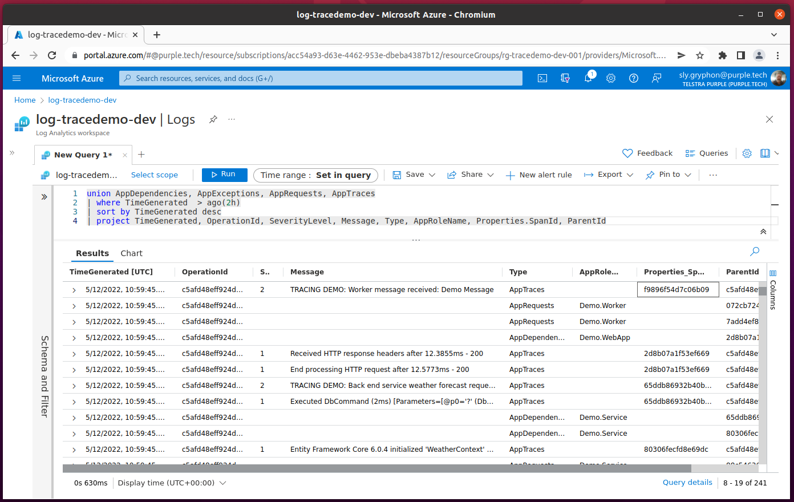
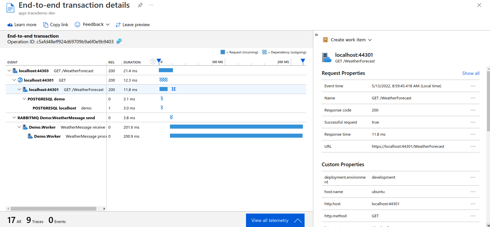
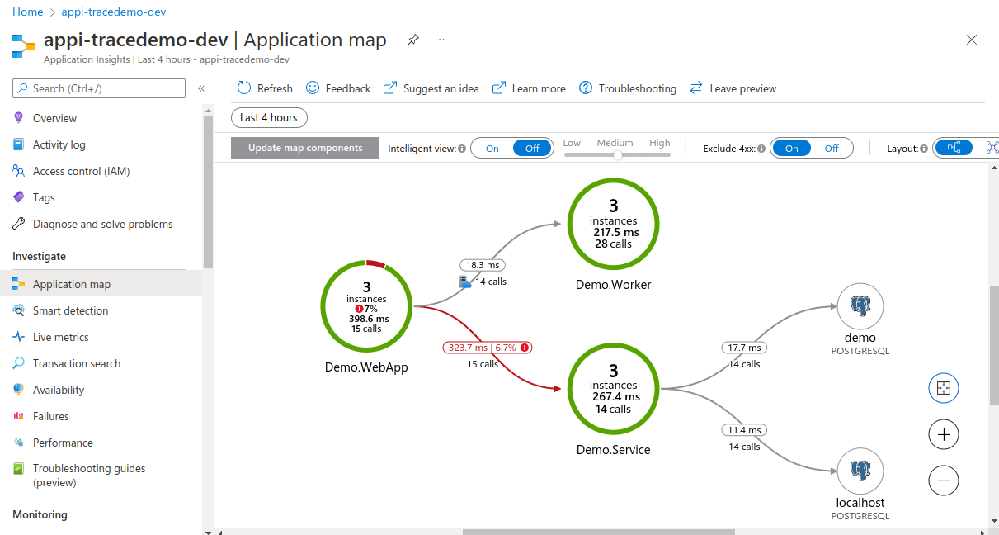

**Dotnet Distributed Tracing Examples**

Example of distributed tracing in .NET, using W3C Trace Context and OpenTelemetry.

(d) OpenTelemetry Collector example
===================================

With many instrumented components, and many destinations, you can quickly get complex many-to-many connections (as can be seen in the complex OpenTelemetry example, with only three components and two destinations).

To address this, and then range of different custom protocols used, OpenTelemetry not only has a standardised way to define traces, metrics, and logs, but also a common OpenTelemetry Protocol, and a Collector service/agent.

This allows a much cleaner instrumentation architecture, with application components forwarding messages to the Collector (possibly using OTLP, although some legacy protocols are also supported), and then the Collector having exporters available for many destination systems.


In the longer term, destination systems have started to support OTLP directly, although it may still be useful to have local agents for batching and augmentation pipelines.


Requirements
------------

* Dotnet 6.0 SDK, https://docs.microsoft.com/en-us/dotnet/core/install/linux-ubuntu
* Node.JS and npm (Node Package Manager), for node, to run the web front end (`sudo apt install nodejs npm`)
* Docker (with docker compose), for local services, https://docs.docker.com/engine/install/ubuntu/
* Azure subscription, for cloud services
* Powershell, for running scripts, https://docs.microsoft.com/en-us/powershell/scripting/install/install-ubuntu
* Azure CLI, to create cloud resources (`sudo apt install azure-cli`)
* tmux, for the demo script (`sudo apt-get install tmux`)


Run local services (RabbitMQ, PostgreSQL, Jaeger, and Loki)
-----------------------------------------------------------

This example has the same architecture and set of docker dependencies as the complex OpenTelemetry example, with local Rabbit MQ, for a service bus, and PostgreSQL (and Adminer), for a database.

For instrumentation destinations we also have Jaeger for traces, along with Loki (with MinIO storage and Grafana front end) for ;logs.

You can start the dependencies via docker compose:

```bash
docker compose -p demo up -d
```

The OpenTelemetry Collector service will also be run in docker, but it will be run separately, after the application is configured.


Set up Azure Monitor workbench and Application Insights
-------------------------------------------------------

Log in to your Azure resources if necessary

```powershell
az login
```

Then use the script to create the required resources, which will also output the required connection string.

```powershell
$VerbosePreference = 'Continue'
./deploy-infrastructure.ps1
```

This will create an Azure Monitor Log Analytics Workspace, and then an Application Insights instance connected to it.

You can log in to the Azure portal to check the logging components were created at `https://portal.azure.com`


Configure OTLP exporters 
------------------------

Building on the complex example where OpenTelemetry instrumentation is already configured, we configure exporters, via the OpenTelemetry Protocol (OTLP) to a local collector.

### Add packages

First of all each project needs to add the OpenTelemetry Protocol exporters:

```bash
dotnet add Demo.WebApp package OpenTelemetry.Exporter.OpenTelemetryProtocol --version 1.3.0-beta.1
dotnet add Demo.WebApp package OpenTelemetry.Exporter.OpenTelemetryProtocol.Logs --version 1.0.0-rc9.3

dotnet add Demo.Service package OpenTelemetry.Exporter.OpenTelemetryProtocol --version 1.3.0-beta.1
dotnet add Demo.Service package OpenTelemetry.Exporter.OpenTelemetryProtocol.Logs --version 1.0.0-rc9.3

dotnet add Demo.Worker package OpenTelemetry.Exporter.OpenTelemetryProtocol --version 1.3.0-beta.1
dotnet add Demo.Worker package OpenTelemetry.Exporter.OpenTelemetryProtocol.Logs --version 1.0.0-rc9.3
```

### Add configuration

Add a configuration section to `appsettings.Development.json`, with the default OTLP port:

```json
  "OpenTelemetry": {
    "OtlpExporter": {
      "Endpoint": "http://localhost:4317/",
      "ExportProcessorType": "Batch",
      "Protocol": "grpc"
    }
  }
```

### OpenTelemetry collector tracing

In `Program.cs`, in the OpenTelemetry configuration, include `AddOtlpExporter()`, binding the options to the configuration section:

```csharp
using OpenTelemetry.Resources;
using OpenTelemetry.Trace;
...

builder.Services.AddOpenTelemetryTracing(tracerProviderBuilder =>
{
    tracerProviderBuilder
        ...
        .AddOtlpExporter(otlpExporterOptions =>
        {
            builder.Configuration.GetSection("OpenTelemetry:OtlpExporter").Bind(otlpExporterOptions);
        });
});
```

### OpenTelemetry collector logging

Instead of writing direct to Elasticsearch, configure logging with `AddOpenTelemetry()`, and then configure `AddOtlpExporter()`, with the same options section. Also turn on settings to include formatted messages, scopes, and state values.

```csharp
using OpenTelemetry.Logs;
...

builder.Logging
    .AddOpenTelemetry(configure =>
    {
        configure
            .SetResourceBuilder(resourceBuilder)
            .AddOtlpExporter(otlpExporterOptions =>
            {
                builder.Configuration.GetSection("OpenTelemetry:OtlpExporter").Bind(otlpExporterOptions);
            });
        configure.IncludeFormattedMessage = true;
        configure.IncludeScopes = true;
        configure.ParseStateValues = true;
    });
```

Configure the collector service
-------------------------------

Before running the collector, you need to create a configuration file, `otel-collector-config.yaml`, with an OTLP receiver and the exporters you need, e.g. Jaeger, Loki, and Azure Monitor.

The settings for Azure Monitor are defined as environment variables, allowing them to be easily passed in.

```yaml
receivers:
  otlp:
    protocols:
      grpc:
      http:

processors:
  batch:

exporters:
  azuremonitor:
    instrumentation_key: "${AZ_INSTRUMENTATION_KEY}"
  jaeger:
    endpoint: jaeger:14250
    tls:
      insecure: true
  logging:
    logLevel: info
  loki:
    endpoint: http://loki:3100/loki/api/v1/push
    format: json
    labels:
      resource:
        deployment.environment: "deployment_environment"
        host.name: "host_name"
        service.name: "service_name"
        service.namespace: "service_namespace"
      record:
        severity: "severity"
    tenant_id: tenant1
    tls:
      insecure: true

service:
  pipelines:
    traces:
      receivers: [otlp]
      processors: [batch]
      exporters: [logging, jaeger, azuremonitor]
    logs:
      receivers: [otlp]
      processors: []
      exporters: [logging, loki, azuremonitor]
```


Run the example
---------------

### Run the OpenTelemetry Collector

You need to pass in the configuration values for Azure Monitor when running the collector container.This uses the Azure CLI, running in PowerShell.

```powershell
$ai = az monitor app-insights component show -a appi-tracedemo-dev -g rg-tracedemo-dev-001 | ConvertFrom-Json
$ai.instrumentationKey
docker run -it --rm `
  -e "AZ_INSTRUMENTATION_KEY=$($ai.instrumentationKey)" `
  --network demo_default `
  -p 4317:4317 `
  -v "$(Join-Path (Get-Location) 'otel-collector-config.yaml'):/etc/otelcol-contrib/config.yaml" `
  otel/opentelemetry-collector-contrib:0.50.0
```

### Run the services

In separate terminals run the service:

```powershell
dotnet run --project Demo.Service --urls "https://*:44301" --environment Development
```

To run the web app front end you need to configure the web API address it will use via an environment variable:

```powershell
$ENV:ASPNETCORE_URLS = "http://localhost:8002"
npm run start --prefix Demo.WebApp/ClientApp
```

Then run the web api in a third terminal:

```powershell
dotnet run --project Demo.WebApp --urls "http://*:8002" --environment Development
```

And run the worker app in a fourth terminal

```powershell
dotnet run --project Demo.Worker --environment Development
```

Generate some activity via the front end at `https://localhost:44303/fetch-data`.

#### Using tmux

There is also a combined script that will use **tmux** to open a split window with all projects running, and the OpenTelemetry collector running on the right:

```bash
./start-collector-demo.sh
```

It will look like this:


View Results
------------

### Jaeger traces

To see traces in Jaeger, open the interface at <http://localhost:16686/>, select the service Demo.WebApp and search, which will show you a graph of all traces that service is involved in, along with some key details such as the number of spans and number of errors.


You can click through a specific trace to see the timeline of hierarchical spans, distributed across the services. You can then drill down into specific span attributes.

Note that the asychronous worker does not complete processing the RabbitMQ message until after the primary span is complete.


Jaeger can also so the system architecture, derived from the message relationships between the services.


### Loki logs (via Grafana)

To see the logs in Loki, open Grafana at <http://localhost:3000/>, and go to the Explore page, then ensure Loki is selected in the drop down.

You can select a stream based on labels, e.g. `service_name`, `deployment_environment`, `host_name`, or `severity` (these are defined in `otel-collector-config.yaml`). You can also use the Log Browser to select the stream values you are interested in.

The selected streams can then be further filtered (e.g. on trace ID), parsed, and formatted.

For example, to select the Demo services and parse the trace ID from the JSON data, use the following query:

```text
{service_name=~"Demo.*"} | json traceid="traceid"
```

Grafana will show a Log Volume graph, which is useful if you are filtering for conditions such as errors.


Below the graph the (raw) log data is shown. For simple scanning, turn on Unique Labels, which will show the other labels, including the parsed traceid, and then open one of the messages and select the "Show this field" icon (an eye) next to the body field.

This cleans up the display and shows key fields (the severity is also indicated in colour on the left), and the log message.


The trace IDs can be used to correlate log messages from the same operation.

#### Extracting the message

The LogQL pipeline can be used to manipulate the output, e.g. the following extracts the traceid, body, and other attrbutes from the JSON message, formats the line with several of the fields, then removes those fields so that 'Unique Labels' can be used to view the remaining (e.g. service and trace ID).

```
{service_name=~"Demo.*"} | json traceid="traceid", id=`attributes["Id"]`, name=`attributes["Name"]`, version=`resources["service.version"]`, body="body" | line_format "{{.severity | upper}}: {{.name}}{{if .id}}[{{.id}}] {{end}}{{.body}}" | label_format id="", name="", body="", severity=""
```

### View results in Azure Monitor

Log in to Azure Portal, https://portal.azure.com/

#### Logs

Open the Log Analytics workspace that was created. The default will be under
Home > Resource groups > rg-tracedemo-dev-001 > log-tracedemo-dev

Select General > Logs from the left. Dismiss the Queries popup to get to an empty editor.

You can use a query like this to view your logs. 

```
union AppDependencies, AppRequests, AppTraces, AppExceptions
| where TimeGenerated  > ago(1h)
| sort by TimeGenerated desc
| project TimeGenerated, OperationId, SeverityLevel, Message, Type, AppRoleName, Properties.SpanId, ParentId
```

You will see the related logs have the same OperationId (trace ID).  AppDependencies and AppRequests represent trace parent/child relationships, while AppTraces are the log messages.



#### Performance

Open the Application Insights that was created. The default will be under
Home > Resource groups > rg-tracedemo-dev-001 > appi-tracedemo-dev

Select Investigate > Performance in the left hand menu, then Operation Name "GET WeatherForecast/Get" (the top level operation requesting the page). The right hand side will show the instances.

Click on "Drill into... N Samples" in the bottom right, then select the recent operation.

The page will show the End-to-end transaction with the correlation Operation ID (the same as the console), along with a hierarchical timeline of events.

There will be a top level event for **localhost:44302** with two children for the **Message** and **localhost:44301** (the back end service).

The "View all telemetry" button will show all the messages, including traces.



#### Application Map

Select Investigate > Application Map in the left hand menu for a picture of how your services collaborate, showing how components are related by messages.

For this simple application, the Hierarchical View clearly shows how the WebApp calls the Service, and also sends a message to the Worker.



